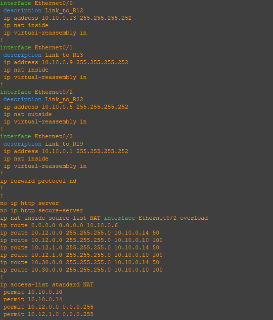
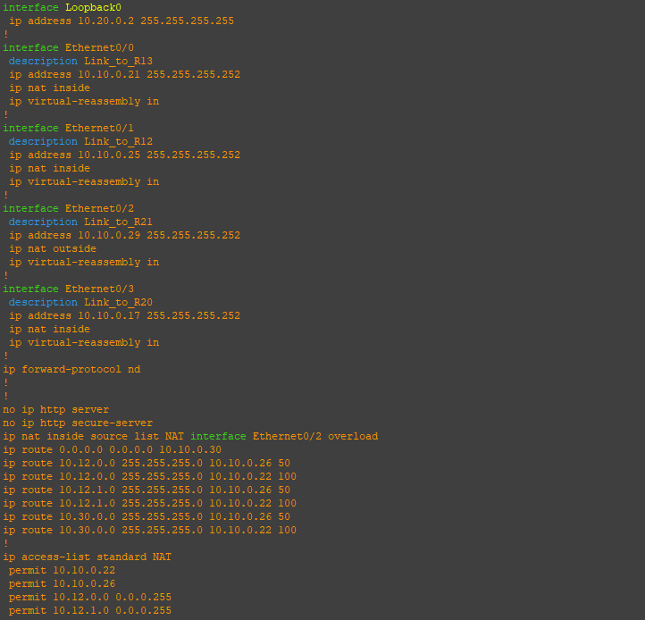
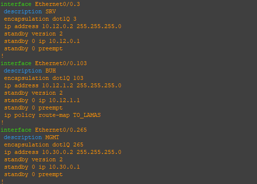
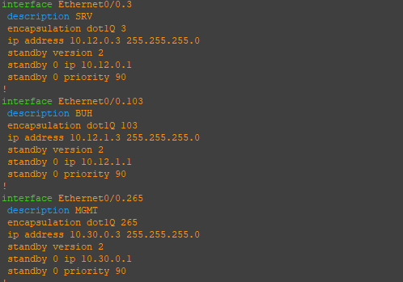
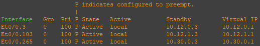
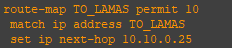
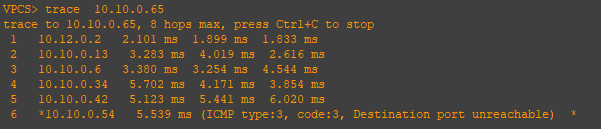
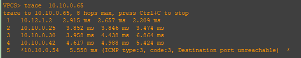

По задумке VPC7/10.12.1.4 должен идти в интернет через PBR через провайдера «Ламас», в отличии от VPC1/10.12.0.4, который ходит в интернет через провайдер «Китрон» по умолчанию  

Перед этим, имитировал реальный интернет. В зоне провайдеров и настроил BGP:  

## R21  
  

## R22  
  

## R23  
  

## R24  
  

## R25  
  

## R26
  

## Настроен NAT на роутерах r14 и r15  

  

Учитываем, что между роутерами r12 и r13 настроен HSRP и r12 является active:  

## R12  
  

## R13  
  

### show standby breef on R12
  

Настроена Route-map на R12 для VPC7/10.12.1.4 должен идти в интернет через провайдера «Ламас»  
  

  

И сам ACL для него  
  

### Наконец проверяем трассировкой хождение трафика от хостов VPC1 и VPC7  

Проверяем VPC1  
  

Проверяем VPC7  
  

