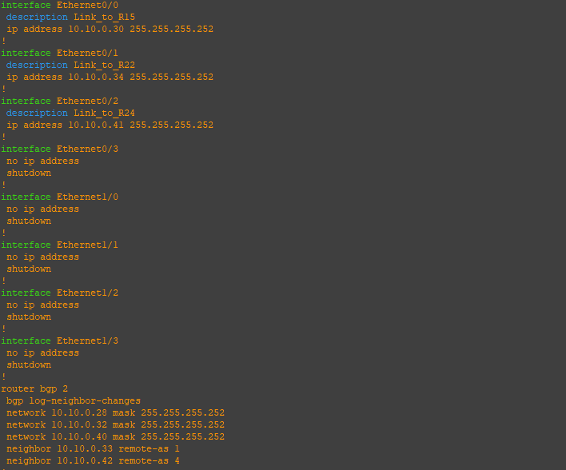
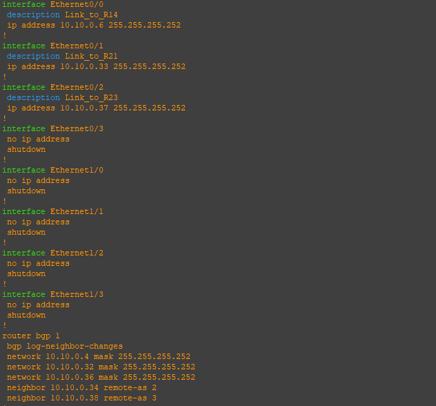
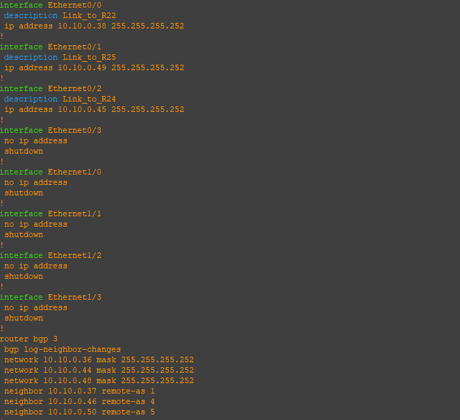
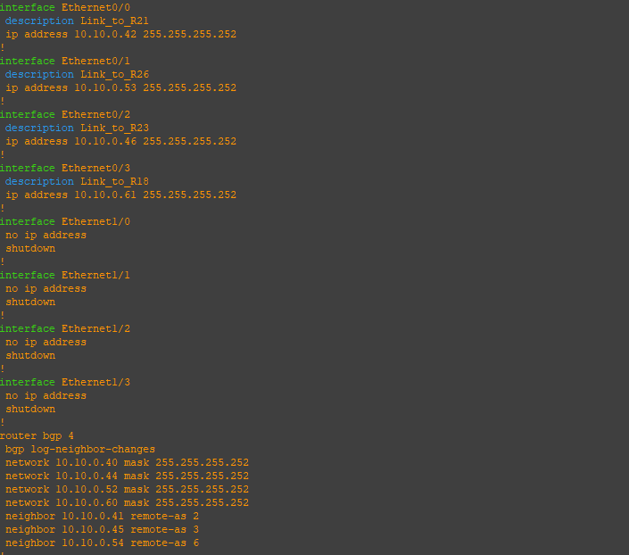
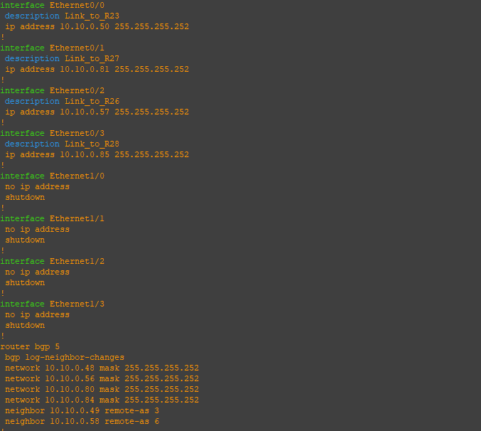
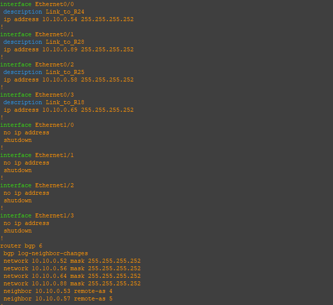

По задумке VPC7/10.12.1.4 должен идти в интернет через PBR через провайдера «Ламас», в отличии от VPC1/10.12.0.4, который ходит в интернет через провайдер «Китрон» по умолчанию  

Перед этим, имитировал реальный интернет. В зоне провайдеров и настроил BGP:  

## R21  
  

## R22  
  

## R23  
  

## R24  
  

## R25  
  

# R26
  

