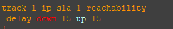

На роутере R12 настроил IP SLA. Идея такая, SLA мониторит состояние линка до провайдера «Китрон». Когда у провайдера «Китрон» на R22 падает порт eth 0/0, срабатывает IP SLA, потом track удаляет маршрут по умолчанию до «Китрон» и активируется следующий маршрут по умолчанию, который ведет к провайдеру «Ламас» через R15, согласно административной дистанции.  

### Некоторые параметры IP SLA:

  

Frequency - Определяет частоту операции. Например, в примере с ICMP-echo этот параметр указывает, что эхо-пакет ICMP будет отправляться каждые 5 секунд.  

Timeout - Устанавливает время (в миллисекундах), в течение которого операция SLA ожидает ответа от своего пакета запроса.  

Threshold - Устанавливает порог, который генерирует событие реакции и хранит хронологическую информацию для операции SLA.  

### Настройка track:  

   

Задержка 15 секунд с момента как о себе даст IP SLA. Задержка 15 секунд с момента того как линия поднимется.  

### Маршруты по умолчанию:

  

Первый маршрут по умолчанию с административной дистанцией, это маршрут, который ведет к провайдеру «Китрон», он с треком. Когда трек срабатывает, данный маршрут исчезает из таблицы маршрутизации и остается маршрут по умолчанию через провайдера «Ламас». И последний перманентный маршрут нужен для того чтобы в таблице оставалась информация, так как когда маршрут по умолчанию уже идет через другой интерфейс, то, когда восстановится у «Китрон» R22 eth0/0 IP SLA восстановит работу и вернет первый маршрут по умолчанию в таблицу маршрутизации.  

## Тестируем:  

Смотрим на текущее состояние IP SLA, все в норме.  

  

Отключаю интерфейс R22 eth0/0.  
Смотрим на текущее состояние IP SLA, теперь таймаут.  

  

Включаю интерфейс  R22 eth0/0 обратно.  
### На скрине VPC7 видно как менялись маршруты при трассировке:  

  

Первая трассировка с включенным интерфейсом R22 eth0/0. Вторая с отключенным. Третья обратно с включенным.  

[Ссылка обратно на лабораторную работу](/labs/lab04/README.md#)

