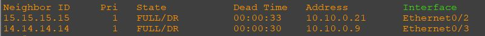
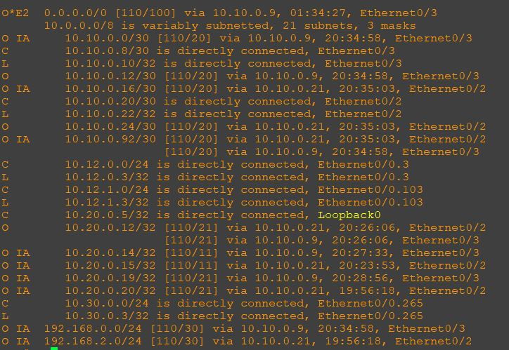

### Общий план топологии:
  

Согласно заданию, роутеры r12-r13 должны находиться в area 10, дополнительно к маршрутам должны получать маршрут по умолчанию. Такие роутеры уже будут как internal, так как ABR r14-r15.  

Пример настройки OSPF r12:  
  

Пример настрйки интерфейсов r12:  
  

Поскольку интерфейсы и протоколы маршрутизации настроены на всех роутерах, которые подпадают под зону 10, время проверить их сопряженность, базы данных и таблицы маршрутизации.  

Начнем с r12, проверим соседство:  
  

Проверим базу данных:  
  

Проверим таблицу маршрутизации ospf:  
  

Проверим таблицу маршрутизации:  
  

Соседство есть, база данных есть, маршруты есть, маршрут по умолчанию есть.  

Пробежимся по выгрузке из r13:  

Проверим соседство:  
  

Проверим базу данных:  
  

Проверим таблицу маршрутизации ospf:  
  

Проверим таблицу маршрутизации:  
  

[Ссылка обратно на лабораторную работу](/labs/lab05/README.md#)

