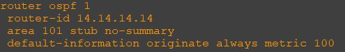
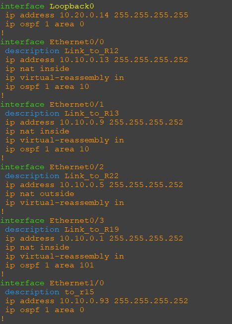
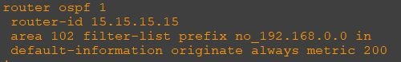
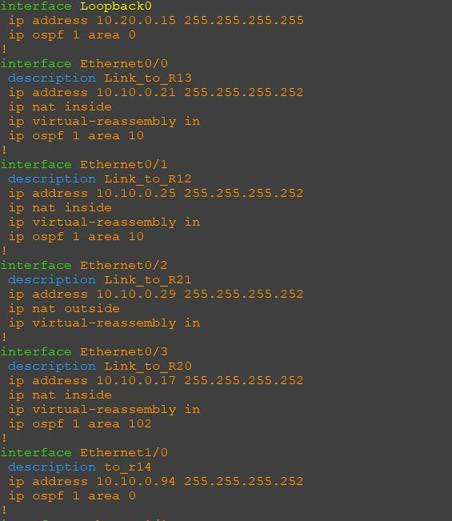

### Общий план топологии:
  

Согласно заданию, роутеры r14 и r15 должны быть роутерами backbone area 0. В нулевую зону подпадают интерфейсы eth1/0 у обоих роутеров, а также их интерфейсы loopback. В нашем случае роутеров internal не будет в данной топологии в area 0, а будут они ABR, потому что они стоят на границе трех других зон.

Пример настройки OSPF r14:  
  

Тут создали процесс под номером 1, задали роутеру ID, и отметили по условию задачи, что area 101 будет totally stab, сделали это на нем, так как данный роутер является ABR в area 101. Еще сделан: R14(config-router)#default-information originate always metric 100. Это связано со вторым заданием для area 10. Метрика тут 100 на r15 200, так как он резервный роутер, резервный ISP. Вот настройка маршрута по умолчанию:  

Пример настроек интерфейсов на r14:  
  
Знаю что можно указать интерфейсы, которые будут в OSPF в настройках самого процесса. Так мне нравится больше, так конкретнее.

[Ссылка обратно на лабораторную работу](/labs/lab05/README.md#)

Пример настройки OSPF r15:   

Тут видим метрику маршрута по умолчанию 200, это резервный роутер с резервным ISP. Так же видим фильтрацию маршрута в зону 102, это связано с условием следующей задачи.  

Пример настроек интерфейсов на r15:  
  

[Ссылка обратно на лабораторную работу](/labs/lab05/README.md#)
