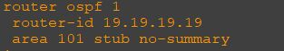
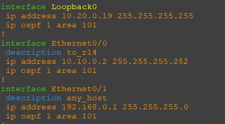
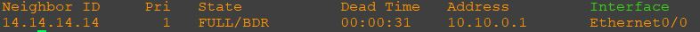
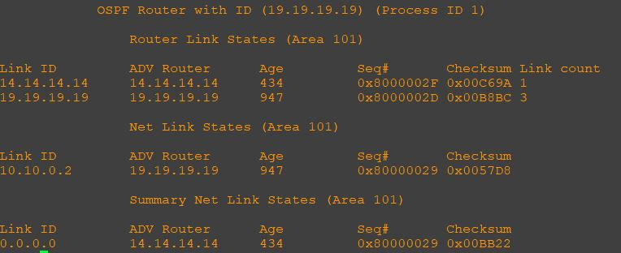
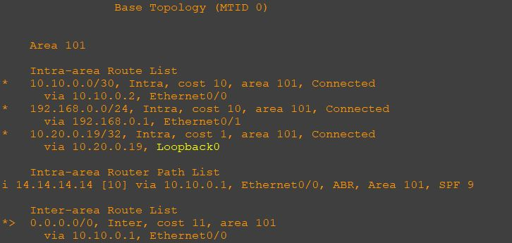
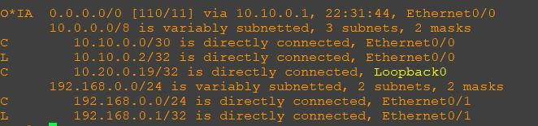

### Общий план топологии:
  

Согласно заданию r19 должен получать только маршрут по умолчанию, никаких LSA 3,4,5. Внутри него могут бегать только LSA 1,2. Взглянем на его настройку и вывод информации. Его зона 101 totally stab.

Настройка протокола маршрутизации:  
  

Настройка интерфейсов:  
  

Проверка соседства:  
  

Проверка базы:  
  

Проверка маршутов OSPF:  
  

Маршруты:  
  

[Ссылка обратно на лабораторную работу](/labs/lab05/README.md#)