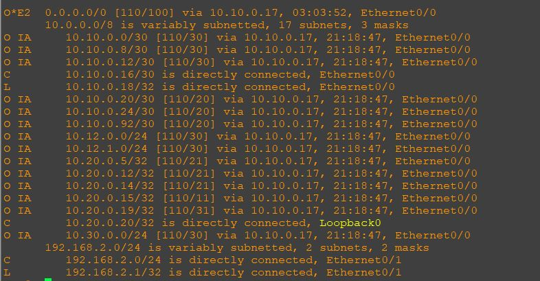

### Общий план топологии:
  

Данный роутер находится в зоне 102 normal. Его задача не принимать маршрут 192.168.0.0/24 от коннектед сети роутера 19. Фильтр настраивается на ABR r15, его настройка отображена в первом разделе. Посмотрим на вывод роутера.

Настройка протокола маршрутизации:  

Настройка интерфейсов:  
  

Проверка соседства:  
  

Проверка маршрутов OSPF:  
  

Проверка маршрутов:  

[Ссылка обратно на лабораторную работу](/labs/lab05/README.md#)