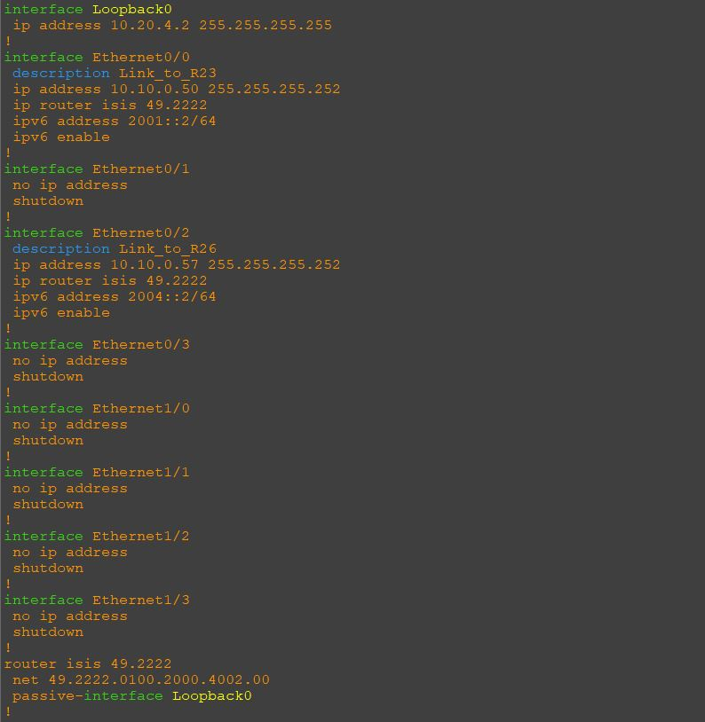

### Общий план топологии:

Согласно заданию R25 при настройке IS-IS должен находится в зоне 2222. На скриншоте наглядно видны настройки протокола динамической маршрутизации и настройки интерфейсов.

Пример настрйки R25:  

  

[Ссылка обратно на лабораторную работу](/labs/lab06/README.md#)
