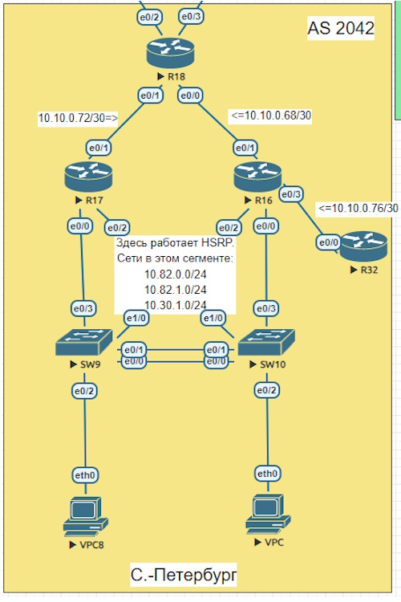

### Общий план топологии:
  

Вначале ознакомимся с настройками интерфейсов. Настройка производилась по двум протоколам, ipv4 и ipv6. 
interface Loopback0  
 ip address 10.20.1.1 255.255.255.255  
 ipv6 address 4018::1/128  
 ipv6 enable  
  
interface Ethernet0/0  
 description Link_to_R16  
 ip address 10.10.0.69 255.255.255.252  
 ipv6 address FE80::1 link-local  
 ipv6 address 3000::1/64  
 ipv6 enable  
  
interface Ethernet0/1  
 description Link_to_R17  
 ip address 10.10.0.73 255.255.255.252  
 ipv6 address FE80::1 link-local  
 ipv6 address 3001::1/64  
 ipv6 enable  
  
interface Ethernet0/3  
 description to_R26  
 ip address 10.10.0.66 255.255.255.252  

 Переходим к настройке EIGRP named-mode. Lo0 сделан как passive-interface, так как туда нет смысла отправлять hello пакеты и искать соседей. Присвоим router-id.  
  
router eigrp EIGRP  
   
 address-family ipv4 unicast autonomous-system 1  
    
  af-interface Loopback0  
   passive-interface  
  exit-af-interface  
    
  topology base  
     exit-af-topology  
  network 10.10.0.69 0.0.0.0  
  network 10.10.0.73 0.0.0.0  
  network 10.20.1.1 0.0.0.0  
  eigrp router-id 18.18.18.18  
 exit-address-family  
 !  
 address-family ipv6 unicast autonomous-system 1  
  !  
  topology base  
  exit-af-topology  
  eigrp router-id 18.18.18.18  
 exit-address-family  
  

[Ссылка обратно на лабораторную работу](/labs/lab07/README.md#)