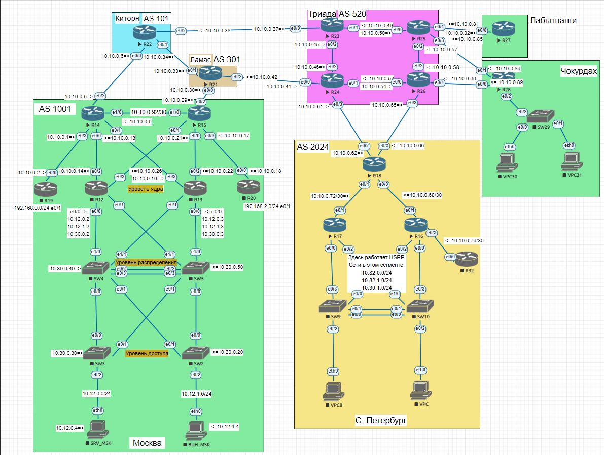

### Общий план топологии:  
  
  
Выполним настройку eBGP между провайдерами "Китрон" и "Ламас" и офисом "Москва". Объекты будут находиться в разных автономных системах.

* [Настройка провайдера "Китрон"](msk-kit-lam.md)  
* [Настройка провайдера "Ламас"](msk-kit-lam_lam.md)  
* [Настройка объекта "Москва"](msk.md)

[Ссылка обратно на лабораторную работу](/labs/lab08/README.md#)  