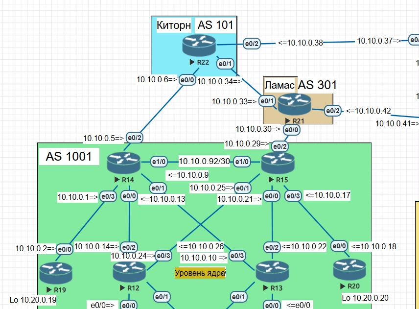
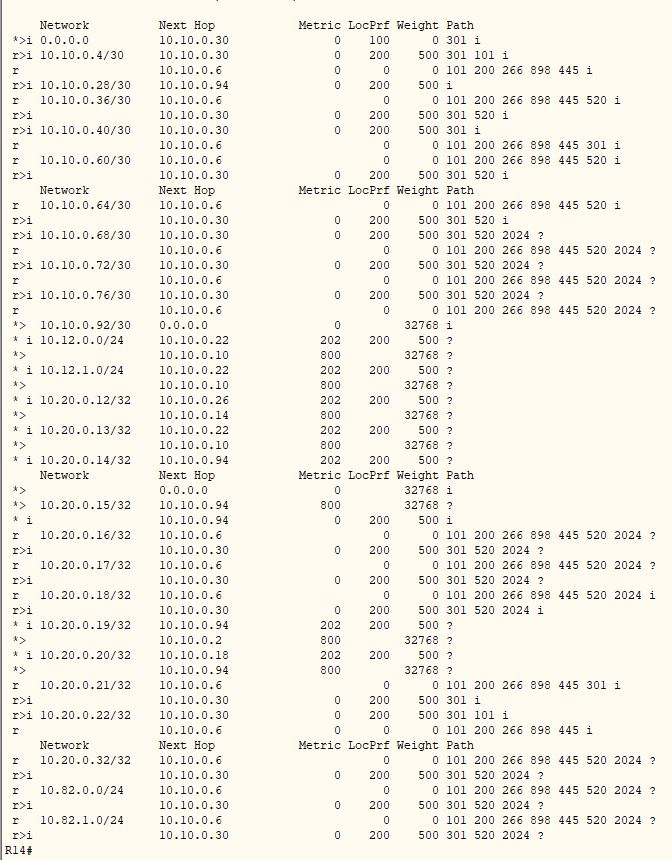

 
На картинке видно, что роутер предпочитает маршрут через r15. Со стороны "Китрон" даже добавлены дополнительные несуществующие AS. 
  
 
[Ссылка обратно на задание](/labs/lab09/test_link/README.md)   
