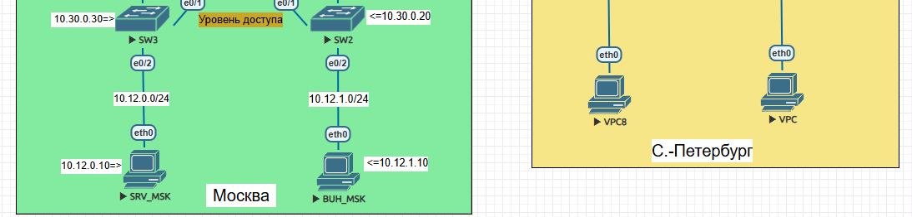
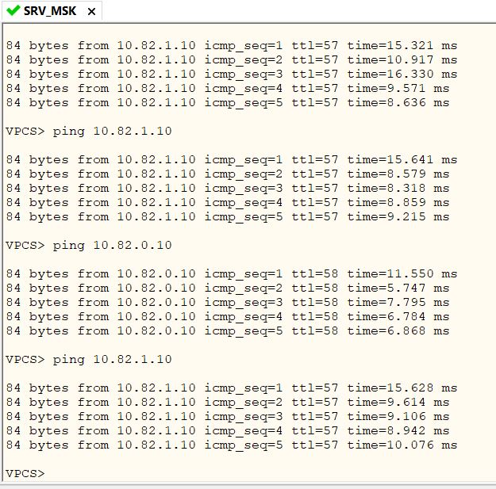
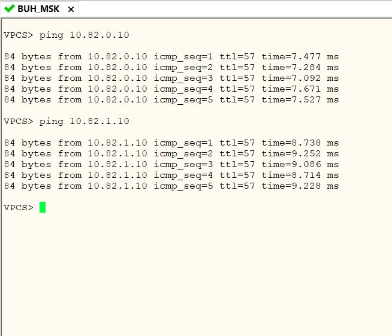

На данном этапе показано тестирование доступности VPC между собой на объектах «Москва» и «С. –Петербург».   
   
SRV_MSK и BUH_MSK пингуют оба ПК VPC8 и VPC, которые находятся в С. –Петербурге.
   
   
[Ссылка обратно на задание](/labs/lab09/test_link/README.md#)   
