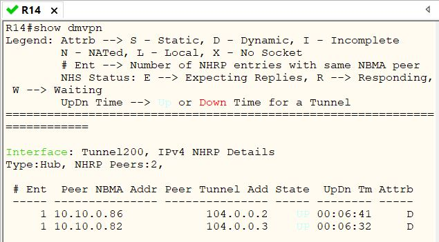
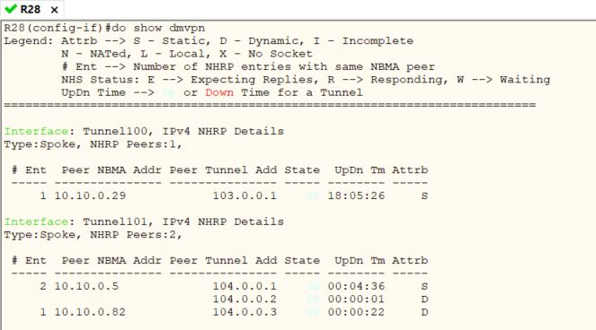
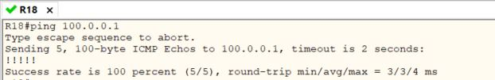

Проверим mGRE на узлах. Между R27 и R28 строится динамика по третьей фазе.

   
   
   
   

## И в заключение обычный GRE между МСК и СПБ работает.   

   

[Ссылка обратно на лабораторную работу](/labs/lab12/README.md#)   