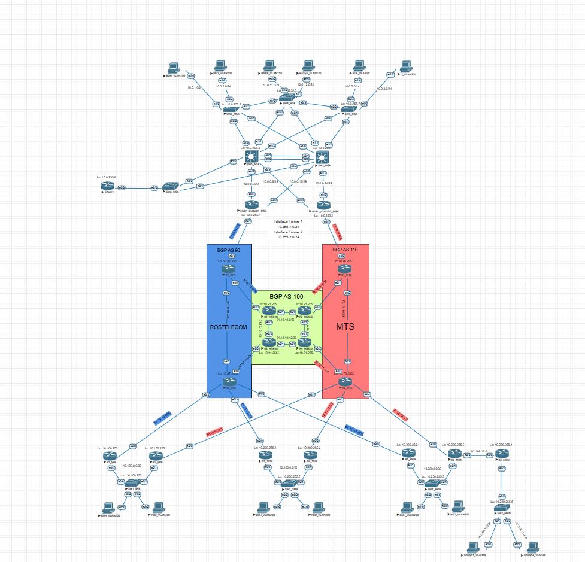

###	Разработать топологию сети
   В схеме имеется четыре друг от друга отдаленных объекта. Первый, это центральный офис, остальные, это разные города, их три. В центральном офисе есть свичи доступа, свичи распределения, они же берут на себя роль ядра. Также имеется по два роутера для отказоустойчивости.  

 

В других городах типовая простая топология, два роутера, один свитч. Есть офис где есть та же простая топология, но имеется редистрибуция EIGRP в OSPF.   

[Ссылка обратно на лабораторную работу](/labs/lab14/front.md)   

